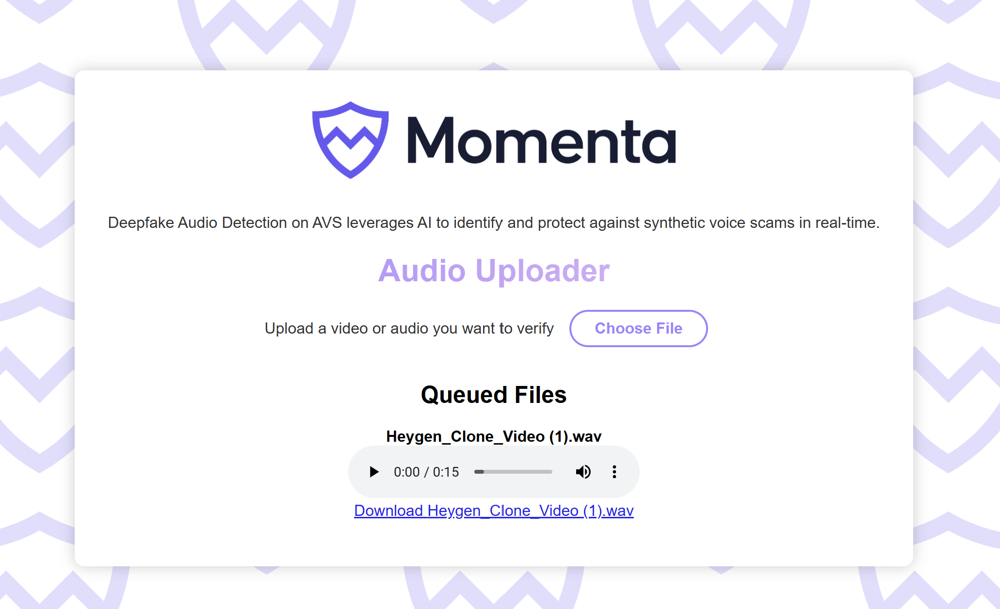

# Audio Uploader


## Table of Contents

- [Introduction](#introduction)
- [Features](#features)
- [Demo](#demo)
- [Getting Started](#getting-started)
  - [Prerequisites](#prerequisites)
  - [Installation](#installation)
  - [Running the Application](#running-the-application)
    - [Using npm](#using-npm)
    - [Using Docker](#using-docker)
- [Usage](#usage)
- [Project Structure](#project-structure)
- [API Endpoints](#api-endpoints)
- [Technologies Used](#technologies-used)
- [License](#license)

## Introduction

**Audio Uploader** is a web application designed to be the UI for uploading and processing audio and video files in the Momenta-AVS application. This application is built with a React frontend and an Express.js backend.

## Features

- **File Upload:** Supports `.wav` and `.mp4` file formats.
- **Real-Time Processing:** Converts video files to audio and processes them for inference.
- **Inference Results:** Determines if the uploaded audio is human or synthetic AI-generated.
- **Queue Management:** Displays a queue of uploaded files with their processing status.
- **Download Capability:** Allows users to download processed files.
- **Responsive Design:** Ensures optimal viewing on various devices.
- **Dockerized Setup:** Easy deployment using Docker and Docker Compose.

## Demo



## Getting Started

Follow these instructions to set up and run the project on your local machine for development and testing purposes.

### Prerequisites

Ensure you have the following installed on your machine:

- [Node.js](https://nodejs.org/) (v18 or later)
- [npm](https://www.npmjs.com/) (comes with Node.js)
- [Docker](https://www.docker.com/) (optional, for containerized setup)
- [Docker Compose](https://docs.docker.com/compose/) (optional, for containerized setup)

### Installation

1. **Clone the Repository**

   ```bash
   git clone https://github.com/your-username/audio-uploader.git
   cd audio-uploader
   ```

2. **Install Dependencies**

   ```bash
   npm install
   ```

3. **Set Up Environment Variables**

   Create a `.env` file in the root directory and specify any necessary environment variables. *(Customize as needed.)*

   ```env
   PORT=3001
   ```

### Running the Application

You can run the application either using `npm` or Docker.

#### Using npm

1. **Using Docker Compose (Recommended)**

   Alternatively, you can use Docker Compose for a simplified setup.

   ```bash
   docker-compose up --build
   ```

1. **Start the Backend Server and Frontend Development Server**

   ```bash
   npm run server
   ```

   > **Note:** Ensure that the backend server script is defined in your `package.json`. If not, you may need to add it or adjust the commands accordingly.

   In a new terminal window, run:

   ```bash
   npm start
   ```

3. **Access the Application**

   Open your browser and navigate to [http://localhost:3000](http://localhost:3000) to view the application.

## Usage

1. **Upload a File**

   - Click on the "Choose File" button.
   - Select a `.wav` or `.mp4` file from your device.

2. **Preview the File**

   - After selecting, a preview of the audio or video will be displayed.
   
3. **Upload the File**

   - Click the "Upload" button to submit the file.
   - The upload status will be displayed below the button.

4. **View Queued Files**

   - Uploaded files will appear in the "Queued Files" section.
   - Each file will show its inference result once processed.

5. **Download Processed Files**

   - Click the "Download" link next to a file to download it.

## Project Structure

- **public/**: Contains static files like HTML, icons, and manifest.
- **src/**: Contains React components, styles, and test files.
- **uploads/**: Directory where uploaded files are stored.
- **server.js**: Express.js backend server handling API requests.
- **Dockerfile**: Instructions to build the Docker image.
- **docker-compose.yml**: Configuration for Docker Compose.
- **start.sh**: Script to start both frontend and backend services.
- **.gitignore**: Specifies files and directories to be ignored by Git.

## API Endpoints

### `POST /upload`

- **Description:** Uploads a `.wav` or `.mp4` file.
- **Request Body:** `multipart/form-data` with a `file` field.
- **Response:**
  - `200 OK` on successful upload.
  - `400 Bad Request` if no file is uploaded or invalid file type.
  - `500 Internal Server Error` on server-side errors.

### `GET /queue`

- **Description:** Retrieves the list of queued files with their download URLs and inference results.
- **Response:**
  - `200 OK` with JSON array of files.
  - `500 Internal Server Error` on server-side errors.

### `GET /download/:filename`

- **Description:** Downloads the specified file.
- **Parameters:**
  - `filename` (path parameter): Name of the file to download.
- **Response:**
  - `200 OK` with the file.
  - `404 Not Found` if the file does not exist.

### `POST /inference-result`

- **Description:** Receives inference results for a file.
- **Request Body:** JSON object with `filename` (string) and `isHuman` (boolean).
- **Response:**
  - `200 OK` on successful recording of inference result.
  - `400 Bad Request` if required fields are missing or invalid.
  - `500 Internal Server Error` on server-side errors.

## Technologies Used

- **Frontend:**
  - [React](https://reactjs.org/) - A JavaScript library for building user interfaces.
  - [Create React App](https://create-react-app.dev/) - Toolchain for creating React applications.
  - [CSS](https://developer.mozilla.org/en-US/docs/Web/CSS) - Styling the application.

- **Backend:**
  - [Express.js](https://expressjs.com/) - Web framework for Node.js.
  - [Multer](https://github.com/expressjs/multer) - Middleware for handling `multipart/form-data`.
  - [Fluent-ffmpeg](https://github.com/fluent-ffmpeg/node-fluent-ffmpeg) - FFmpeg bindings for Node.js.
  - [cors](https://github.com/expressjs/cors) - Middleware for enabling CORS.

- **Others:**
  - [Docker](https://www.docker.com/) - Containerization platform.
  - [Docker Compose](https://docs.docker.com/compose/) - Tool for defining and running multi-container Docker applications.

## License

This project is licensed under the [MIT License](LICENSE).
